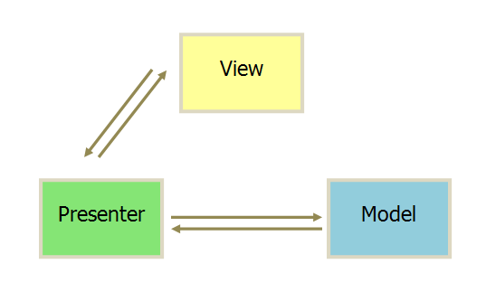

## 滴滴 -- 孔阿栋
1. 研究生的研究方向，为什么面前端
2. JavaScript学的怎么样？ES6有看过吗？你觉得ES6什么比较好用？
3. 箭头函数和普通函数的区别。

箭头函数：
    1. 只有一个参数，函数体只有一行：`var f = v => v;`, 函数体默认返回v
    2. 如果没有参数或有多个参数，需要用圆括号包裹
    3. 如果函数体多于一行，需要用花括号包裹，并需要使用return语句
    4. 由于花括号被解析为一个代码块的开始，所以如果只返回一个对象需要用圆括号包裹`var f = () => ({});`

箭头函数和普通函数的区别：
    1. 箭头函数没有自己的this值，箭头函数内的this值继承自外围作用域。因此也不能使用call(),apply(),bind()这些方法去改变this的指向
    2. 箭头函数没有自己的arguments,如果需要可以使用剩余函数代替...arguments
    3. 箭头函数不可以用作构造函数，即不可以使用new操作符，也没有prototype属性。
    4. 箭头函数不可以使用yield操作符，因此箭头函数不可以用作generator函数
4. promise多异步流程怎么实现
5. 什么叫多人博客？用户管理是怎么写的？都是你自己写的吗？数据库用的是什么？
6. 你还用过其他的数据库吗？mongodb和mysql的区别。
7. mongodb能做笛卡尔积吗？这个不懂在问什么
8. 后端用过什么语言？什么会用的好一点？
9. vue做的是单页应用吗？你觉得vue这种MVVM框架和之前的框架有什么区别？

    MVC：
    
    View 传送指令到 Controller, Controller 完成业务逻辑后，要求 Model 改变状态, Model 将新的数据发送到 View，用户得到反馈
    **所有通信都是单向的**

    MVP
    
    通信是双向的，view和model不发生联系， 都通过Presenter传递。

    MVVM：
    
    将MVP的Presenter改名为ViewModel，基本与MVP模式完全一致，唯一区别是MVVM采用双向绑定，view的变动，自动反应到ViewModel，反之亦然。

    MVVM的view和viewmodel可以双向通信，也就是可以相互调用，mvc中的是单向通信，view和model必须通过controller来承上启下。
10. 数据双向绑定是怎么实现的？vue有用虚拟dom概念吗？
11. 你的单页能做到按需加载吗？

    单页应用：一个系统只加载一次资源，之后的操作交互、数据交互是通过路由、ajax来进行，页面并没有刷新。特点是加载次数少，加载以后性能较高， 不利于seo。在一个页面上集成多种功能，甚至整个系统就只有一个页面，所有的业务功能都是它的子模块，通过特定的方式挂接到主界面上。

    单页应用相比传统的网页型网站相比，更加依赖于JavaScript，而且由于页面的单页化，各种子功能的JavaScript代码聚集到了同一个作用域，所以代码的隔离、模块化变得很重要。

    单页应用最根本的缺陷就是不利于SEO，因为界面的绝大部分都是动态生成的，所以搜索引擎很不容易索引它。

    代码合并与加载策略：可以把更多的公共功能放到首次加载，以减小每次加载的载入量。通常在单页应用中，无需像网站型产品一样，为了防止文件加载阻塞渲染，把js放到html后面加载，因为它的界面基本都是动态生成的。通常在单页应用中，无需像网站型产品一样，为了防止文件加载阻塞渲染，把js放到html后面加载，因为它的界面基本都是动态生成的。当切换功能的时候，除了产生数据请求，还需要渲染界面，这个新渲染的界面部件一般是界面模板，它从哪里来呢？来源无非是两种，一种是即时请求，像请求数据那样通过AJAX获取过来，另一种是内置于主界面的某些位置，比如script标签或者不可见的textarea中，后者在切换功能的时候速度有优势，但是加重了主页面的负担。在传统的页面型网站中，页面之间是互相隔离的，因此，如果在页面间存在可复用的代码，一般是提取成单独的文件，并且可能会需要按照每个页面的需求去进行合并。单页应用中，如果总的代码量不大，可以整体打包一次在首页载入，如果大到一定规模，再作运行时加载，加载的粒度可以搞得比较大，不同的块之间没有重复部分。

    路由与状态管理：管理路由的目的是什么呢？是为了能减少用户的导航成本。比如说我们有一个功能，经历过多次导航菜单的点击，才呈现出来。如果用户想要把这个功能地址分享给别人，他怎么才能做到呢？传统的页面型产品是不存在这个问题的，因为它就是以页面为单位的，也有的时候，服务端路由处理了这一切。但是在单页应用中，这成为了问题，因为我们只有一个页面，界面上的各种功能区块是动态生成的。所以我们要通过对路由的管理，来实现这样的功能。具体的做法就是把产品功能划分为若干状态，每个状态映射到相应的路由，然后通过pushState这样的机制，动态解析路由，使之与功能界面匹配。有了路由之后，我们的单页面产品就可以前进后退，就像是在不同页面之间一样。

    服务端通信：传统的Web产品通常使用JSONP或者AJAX这样的方式与服务端通信，但在单页Web应用中，有很大一部分采用WebSocket这样的实时通讯方式。WebSocket与传统基于HTTP的通信机制相比，有很大的优势。它可以让服务端很便利地使用反向推送，前端只响应确实产生业务数据的事件，减少一遍又一遍无意义的AJAX轮询。由于WebSocket只在比较先进的浏览器上被支持，有一些库提供了在不同浏览器中的兼容方案，比如socket.io，它在不支持WebSocket的浏览器上会降级成使用AJAX或JSONP等方式，对业务代码完全透明、兼容。
12. 单页会保存场景吗？
13. 说一下归并和快排。快排为什么不稳定？时间复杂度分析。快排怎么样能尽量做到平均复杂度？
14. 你觉得做前端需不需要掌握算法？
15. sql语言熟吗？批量更新，更新内容不同，怎么用一个语句实现？
16. 你用java做过抓包？你的检索是自己写的吗？
17. echarts渲染使用canvas渲染，你觉得为什么不用svg渲染？
18. 你学算法有接触过动态规划和贪心吗？说一下区别。
19. C有引用吗？
20. 栈存储和堆存储的区别。
