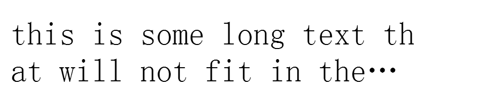

## 移动终端web
慕课网《hello，移动WEB》课程笔记

### pixel像素
* px：CSS pixels 逻辑像素，浏览器使用的抽象单位
* dp，pt：device independent pixels 设备无关像素 (设备分辩率单位)
* dpr： devicePixelRatio 设备像素缩放比
计算公式：1px = (dpr)^2 * dp

* DPI:打印机每英寸可以喷的墨汁点
* PPI：屏幕每英寸的像素数量，即单位英寸内的像素密度

Retina屏(高清屏)：dpr都是大于等于2

### viewport
手机浏览器默认为我们做了两件事情：
1. 页面渲染在一个980px(ios)的viewport
2. 缩放

viewport包括visual viewport 和 layout viewport

### viewport meta标签
```
<meta name="viewport" content="name=value, name=value">
```
* width: 设置布局viewport的特定值("device-width")
* initial-scale: 设置页面的初始缩放
* minimum-scale： 最少缩放
* maximum-scale： 最大缩放
* user-scalable： 用户能否缩放

### 响应式设计
#### 媒体查询 media
媒体类型：
* screen(屏幕)
* print(打印机)
* handheld(手持设备)
* all(通用)

常用媒体查询参数：
width：视口宽度
height：视口高度
device-width：设备的宽度
device-height：设备的高度
orientation：检查设备处于横向(landscape)还是竖屏(portrait)

* 百分比布局
* 弹性图片 img{max-width:100%}
* 重新布局，显示与隐藏：同比例缩减元素尺寸，调整页面结构布局，隐藏冗余的元素，经常需要切换位置的元素使用绝对定位，减少重排提高渲染性能

关于响应式的思考：根据响应式设计的理念，一个页面包含所有设备不同屏幕的样式和图片，当一个移动设备访问一个响应式的页面，就会下载PC、笔记本、ipad等不同设备对应的样式，而这些样式是冗余的，完全没有用。因此是否使用响应式布局，需要权衡利弊，响应式好处是可以减少重复开发，但是性能可能不是最优的。

### 移动web页面特殊问题的处理
#### 高清图片
retina屏幕，由于dpr为2，所以如果原本100*100的图像就设置为100px*100px的话，在retina屏幕下渲染时，实际是200dp*200dp，因此图片就会被拉大变得模糊。

因此，在移动web页面渲染图片，为了避免图片产生模糊，莆田的宽高应该用物理像素单位渲染，即100*100的图片，应该使用100dp*100dp。

### 一像素边框
同样是retina屏幕下的问题，1px边框渲染时实际是2dp，所以会变粗

解决办法：scaleY(.5)
```
li{
    padding:8px 0 8px 15px;
    color: #7c7c7c;
    cursor: pointer;
    position: relative;
}
li::after{
    position: absolute;
    bottom:-1px;
    left:0;
    content: "";
    width:100%;
    height:1px;
    border-top: 1px solid #ddd;
    transform: scaleY(.5);
}
```

### 文本溢出
#### 单行文本溢出
```
<div class="para">
    this is some long text that will not fit in the box
</div>
.para{
    width:50px;
    overflow: hidden;
    white-space: nowrap; //规定文本不进行换行
    text-overflow: ellipsis; //值为ellipsis规定当文本溢出包含元素时用省略符号代表修剪的文本，值为clip表示修剪文本
}
```
#### 多行文本溢出
```
.para{
    width:200px;
    overflow: hidden;
    word-break: break-all;
    text-overflow: ellipsis;
    display: -webkit-box!important；
    -webkit-box-orient: vertical; //子元素排列方向
    -webkit-line-clamp:2; //控制需要显示的行数
}
```


### tap事件
自定义tap事件原理：在touchstart、touchend时记录时间、手指位置，在touchend时进行比较，如果手指位置为同一位置(或允许移动一个非常小的位移值)且时间间隔较短(一般认为是200ms)，且过程中未曾触发过touchmove事件，即可认为触发了手持设备上的“click”，一般称它为“tap”。一般引用移动框架库Zepto.js实现.
