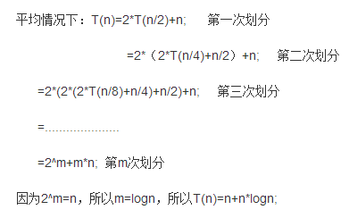

## 腾讯
### 一面 -- 芦荟
1. 实习时间
2. 死锁是怎么产生的？死锁的四个条件（互斥使用，不可抢占，请求和保持，循环等待）

    进程之间竞争资源，或者进程推进顺序非法，导致多个进程处于一种僵持状态，若无外力作用，它们都将无法向前推进。

    死锁四个条件：
    1. 互斥：一个资源只能被一个进程使用
    2. 请求与保持：一个进程因请求资源而阻塞时，对已获得的资源保持不放
    3. 不剥夺：进程已获得的资源，在未使用完之前，不能强行剥夺
    4. 循环等待：若干进程之间形成一种头尾相接的循环等待资源关系
2. 快排的思想，快排最优的时间复杂，为什么是nlogn

    
3. TCP和UDP的区别
4. 重排和重绘的区别
5. 局部变量以及全局变量是放在内存中的什么位置
### 二面
1. 自我介绍
2. 怎么系统的学习前端的
3. nio(不懂,java的)
4. 介绍js知识点，js中有哪些容易犯错或理解不到的知识点
5. xss csrf
6. mongodb 和mysql的区别
7. 项目问了代码量 没具体问项目中的内容
8. acid
9. 编译原理里的状态机
10. 哪些常见的数据结构 我说了链表 数组 堆 栈 又问了我链表和数组插入数据和查找数据的时间复杂度

    1. 数组：是顺序存储，访问数组中第n个数据是O(1)，插入或删除时，后面的数据需要全部移动，移动的数据和数据总数有关，所以插入和删除的总体事件复杂度是O(n)。数组需事先固定长度，不能动态增减，数组从栈中分配空间，
    2. 链表：是非顺序存储，在非连续的内存单元中保存数据，通过指针将各个内存单元链接在一起，访问第n个数据的时间复杂度是O(n)，插入和删除数据的时间复杂度是O(1).链表动态地进行存储分配，从堆中分配空间。
11. 哈夫曼算法 我知道怎么求哈夫曼距离，没写过这个算法。(太诚实了)

    哈夫曼树：
    1. 定义：由n个带权叶子结点构成的所有二叉树中带权路径长度最短的二叉树。
    2. 过程：
        1. 初始化：根据给定的n个权值{w1,w2,…wn}构成n棵二叉树的集合F={T1,T2,..,Tn}，其中每棵二叉树Ti中只有一个带权wi的根结点，左右子树均空。
        2. 找最小树：在F中选择两棵根结点权值最小的树作为左右子树构造一棵新的二叉树，且至新的二叉树的根结点的权值为其左右子树上根结点的权值之和。
        3. 删除与加入：在F中删除这两棵树，并将新的二叉树加入F中。
        4. 判断：重复前两步（2和3），直到F中只含有一棵树为止。该树即为哈夫曼树
12. 对css html兼容性的理解 我说了一些css常见的hack技术
13. 介绍你知道的加密算法。

    1. 不基于key的加密算法：就是消息双方都通过一定的加密和解密算法来进行通信，缺点是如果加密算法被破解了就泄露了。
    2. 基于key的加密算法：
        1. 对称加密：通信一方用key加密明文，另一方收到之后用同样的key来解密就可以得到明文。
        2. 不对称加密：双方用不同的key加密和解密明文，双方都要有自己的公共密钥和私有密钥。通信双方交换公共秘钥，用自己的私有密钥加密，用对方的公共秘钥解密
14. 一个客户端和一个服务器，客户端如何能知道是服务器发过来的数据呢？我说用ssl，他说这是现成的，如何用最简单的方法实现。他告诉我可以用私钥和公钥。

    ssl(Secure Socket Layer 安全套接层)：认证用户和服务器，确保数据发送到正确的客户机和服务器，加密数据以防止数据中途被窃取，维护数据的完整性，确保数据在传输过程中不被改变。ssl协议位于TCP/IP协议与各种应用层协议之间，为数据通讯提供安全支持。分为两层：ssl记录协议和ssl握手协议。记录协议建立在可靠的传输协议上，为高层协议提供数据封装、压缩、加密等基本功能的支持，握手协议建立在记录协议之上，用于在实际的数据传输开始前，通讯双方进行身份认证、协商加密算法、交换加密秘钥等。

15. http协议的keep alive
16. js是单线程的，如何实现异步呢？
17. 前台js和后台js有什么区别
18. 问了实习时间和来深圳这边什么看法

### 三面
1. 自我介绍
2. ＝＝＝ 和＝＝啥区别
3. 强制类型转换
4. 项目会测试哪些主流浏览器
5. firefox的内核是什么 市场占有比是多少
6. java虚拟机了解多少
7. 浏览器页面分层 可以分为哪几层(面试官自己把答案说出来了，表现层 行为层 。。层 html js css)

    html：结构层  css：表现层  js：行为层
8. css 是怎么实现的(不懂在说啥，我就说了页面绘制的过程)
9. 数据库断电如何保证数据健壮性(日志和回滚)
10. 浏览器怎么优化
11. 浏览器内存占用太多了是什么原因，应该怎么办

    原因：缓存多，图片、动画、声音等资源多

    解决方法：减少打开的页面，收藏网页，清除缓存
12. 知道哪些浏览器，如何保证不同浏览器的兼容

    shim：是一个库，将一个新的API引入到一个旧的环境中，而且仅靠旧环境中已有的手段实现
    Polyfill：是一个用在浏览器API上的shim，通常的做法是先检查当前浏览器是否支持某个API，如果不支持就加载对应的polyfill，然后新旧浏览器就都可以使用这个API了。例如Modernizr。也可以自己实现
    ```
    if(typeof JSON.parse !== 'function'){
        //自己实现一个JSON.parse
    }
    ```
13. 缓存怎么实现
14. tcp三次握手
15. 在手机终端显示需要注意些什么

    1. 页面中关乎布局的元素用百分比设置宽高
    2. 字体使用相对大小的字体
    3. 使用浮动，各个盒子的位置不固定不变的
    4. 尽量不要使用绝对定位
    5. 根据屏幕的宽度家在相应的css文件，css文件中根据不同的分辨率设置不同的css风格
    6. 图片自动缩放，自适应大小
    7. 设置meta标签
16. 问我有什么问题(愣住了。。。没什么问题很尴尬，就勉强问了你觉得我面的怎么样。。。)
17. 动手能力怎么样  学习能力怎么样
18. 都说四川人比较慢 你怎么样 (最后告诉我他也是四川的)

### hr
1. 自我介绍
2. 本科保研其他同学都去了哪些学校
3. 做项目最大的收获和成就是什么
4. 兴趣爱好(我说我喜欢读书，他问我都读些什么书，用什么工具，他说他也用微信读书，看了我的书架和读书时长。。)
5. 职业规划
6. 什么时候能来实习之类
7. 有收到其他offer吗？
8. 如果多个公司都给你offer你会怎么选择
(他说前两个面试官对我的评价都很不错，尤其是第二个面试官，可是我觉得我二面答得不太好，难道是老乡？？然后hr说，他肯定也会让我通过，但是可能会有一个电话加面)

### 四面
1. TCP滑动窗口机制是一个什么样的工作过程？
2. HTTP协议常见协议头的cachecontrol，有哪些取值？maxage的含义？cache有效是在哪进行判断的，是在服务器端进行判断还是在客户端进行判断
3. 301 302 307 304
4. cookie和session的区别和联系在哪里？具体是怎么实现利用cookie实现session的关联？session是存在服务器端的怎么跟每一个客户端进行关联的？session在服务端的数据结构是怎么存的？用户访问网站的时候，浏览器还没打开，这个session是怎么生成的？怎么初始化的？服务器端回写cookie回写哪些内容？回写的name value domain分别取哪些值？给cookie设置sessionId之后，下一次访问的时候怎么根据sessionID来获取session的信息？
5. 快排的思想
6. 树的后序遍历是什么样的算法
7. 从前端的眼光做前端的网站，会考虑哪些可以优化的点？有没有关于网络方面的优化方法？

### 一面 -- 阿栋
1. 实习时间
2. 说一下前端的项目经验
3. 问卷平台遇到什么困难怎么解决的？
4. 木桶布局是什么布局？问横向有滚动条吗？问你这个布局可以用css实现吗？然后我就说了一遍实现的原理，说都需要JS操作。
5. 说一下网页抓取。如果有一个人在用模拟器拉取你的网页，你怎么判断它是真的用户还是用的模拟器拉取的？
你抓的是哪儿的数据？频限问题怎么处理？
6. JQuery用过吗？
7. Ajax在什么情况下可以跨域？我说level2提供了CORS。面试官说没听过2。说一下其他的跨域。我说jsonp，这是一个get请求，数据有限制的吧。如果我有个数据很大，用http get肯定不行，又想跨域应该怎么办。我说post请求，postMessage是不是可以？面试官说postMessage有兼容性问题，低版本浏览器怎么办？
8. 问一个安全相关的问题。说一下csrf。它是怎么伪造的？怎么拿用户的cookie？问可以读取用户的cookie吗？
9. 你这个上海邀请赛是什么奖？ACM
10. 你答的不够深入，再了解一下，再深入一些会更强。你有什么问题？

### 二面
1. 实习时间
2. 你为什么做前端？通过什么样的渠道来学习？你以后把前端当作职业选择？你怎么看前端技术未来是绿野长青还是走到头？你怎么知道公司要做前后端开发。前端比重越来越大你怎么得出这样的结论？阻塞和非阻塞什么区别？
3. 你做的项目中做的最好的是哪个？为什么觉得它做的好？因为它是一个完整的过程你就觉得好？好的标准你怎么定义？那你为什么选mongodb？mongodb适合于哪些场景？那你觉得mongodb优点缺点是什么？对js这种语言你觉得缺点是什么？
4. 你对闭包怎么评价？我说一些特定的情况下需要使用闭包但是不能滥用，会有内存的问题。然后问为什么会有内存的问题？因为它把变量暴露在全局中延长了生命周期所以就会内存泄漏吗？
java的垃圾回收机制会不会出现内存泄漏？js不是因为暴露在外面就造成内存泄漏吧，那怎么解决这个问题呢？那要是忘记清除它的引用呢？有没有具体的方法实现内存及时释放的机制？
5. 我看你做过网页爬虫。怎么解析网页结构
6. 平时上网前端会有DNS解析，你知道解析过程，怎么解析的吗？它为什么要设计成这样子？
7. 你了解CDN吗？目的是什么？

    CDN是构建在网络之上的内容分发网络，依靠部署在各地的边缘服务器，通过中心平台的负载均衡、内容分发、调度等功能模块，使用户就近获取所需内容，降低网络拥塞，提高用户访问响应速度和命中率，CDN的关键技术主要有内容存储和分发技术。基本原理是广泛采用各种缓存服务器，将这些缓存服务器分布到用户访问相对集中的地区或网络中，在用户访问网站时，利用全局负载技术将用户的访问指向距离最近的工作正常的缓存服务器上，有缓存服务器直接响应用户请求。
8. 你还有什么要了解的？

### 三面
* 自我介绍
* session和cookie的区别
* get和post的区别，post表单有什么格式？

    1. application/x-www-form-urlencoded: 浏览器的原生form表单如果不设置enctype属性，最终会以这种方式提交数据。请求头的Content-Type被指定为application/x-www-form-urlencoded，提交的数据按照key=value&key=value的方式进行编码，key和value都进行URL转码。
    2. multipart/form-data：使用表单上传文件时，必须设置form的enctype等于这个值。
    3. application/json：序列化后的JSON字符串，JSON支持比键值对复杂得多的结构化数据。
    4. text/xml
* amd和cmd，这块儿居然忘了哪个是哪个了。。。
* 介绍盒子模型
* 冒泡分几个阶段，我觉得是面试官说错了。怎么禁止冒泡
* 有做过单页的应用吗？介绍一下MVC、MVVM
* 用过jsonp吗？是get还是post请求？跨域有哪些方法？
* 以前有实习过吗？

### 四面
* 你现在还有在做ACM吗？
* 浏览器访问后台的整个过程。
* 字符串匹配都用哪些算法。kmp算法复杂度多少。AC自动机实现原理。trie树每个节点都需要开一个数组吗？
* 单链表判断是否有环。
* 给一个数组寻找第一个不在数组中的最小正整数。
* 一个矩阵，从左上走到右下，只能向右向下，求最大路径和。给出最优空间时间复杂度。如果要求走过的路径中不允许权值<0，需要做什么特殊处理？
* 欧几里得算法复杂度

### 五面
* 实习时间
* 我看你之前做ACM，你为什么做前端？你在前端都为你的兴趣做过什么事情？你一般学习的方式和途径？前端你都去什么网站？前端做的比较好的网页全球有哪些？或者你觉得做的好的比较欣赏的前端网页？
* 怎么衡量一张图片到底是美还是丑？前端做的东西是给用户看的，你怎么看？
* QQ和微信哪个做的好哪个做的不好？从前端的观点，app界面的设计
* 判断一个QQ号是否被盗？
* 在家里看电视突然停电了，怎么判断是自己家停电还是这栋楼停电？
* 有什么爱好。最近在阅读了解的东西。
* 给你1000块钱来深圳腾讯实习三个月，你有什么计划打算？从哪里了解房源信息？带什么行李带多少？怎么应对突发的事情？

### 六面
1. 说自己做过的前端项目，哪些是自己做的，哪些是和导师做的？
2. 现在的状态？还在和老师做项目？
3. 方便参加实习的时间。实习地点是在深圳，你是山西人，工作地点的考虑？
4. 看你本科不是计算机，你怎么考虑的，专业还是有跨度的。跨专业保送说一下情况。
5. 论文的课题，奖学金情况，学习成绩。
